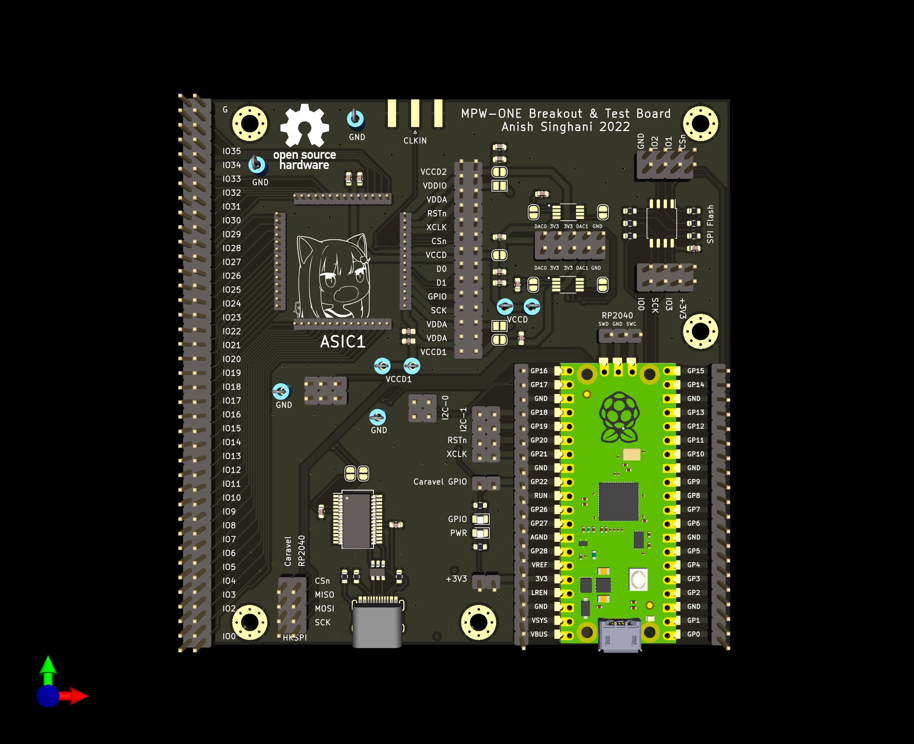
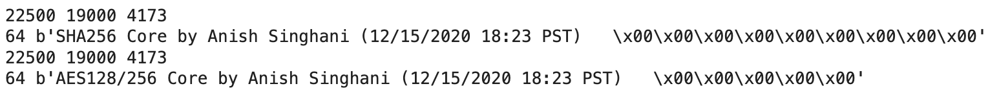
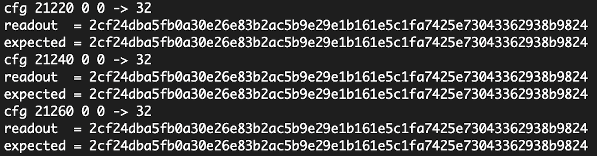

# mpw1-bringup

Experiments in salvating SKY130 MPW-ONE chips, 1.5 years after the initial tapeout in December 2020.

### Background

MPW-ONE was the first round of the open-source Google-sponsored tapeout, and as a result of tooling issues with the clock-tree verification, the standard "caravel" padframe used for all chips on the MPW contains timing violations. In this repo I am working with my submission to MPW-ONE and attempting to recover functionality using precise voltage and clock control to reduce the significance of these issues - [asinghani/crypto-accelerator-chip](https://github.com/asinghani/crypto-accelerator-chip)

### Board images

### Progress

- Designed test board (see images above) with a Raspberry Pi Pico and DAC8571
- Implemented firmware (`ctrlfw/remote_ctrl_fw`) and associated Jupyter Notebooks (`notebooks/characterization.ipynb`) for searching possible voltages
- Tested ~50 dies and found some that produced sufficient activity on the Flash memory bus
- Implemented communication protocol in RISC-V assembly which allows bytes to be bit-banged (independent of clock frequency) through the single Caravel GPIO port. This means that non-default GPIO does not need to be enabled in order to get data out of the Caravel core.
- Used this protocol to read the identifier ROMs in the SHA256 and AES cores
- Wrote RISC-V code to Caravel to run short tests of SHA256 and AES256 operations

