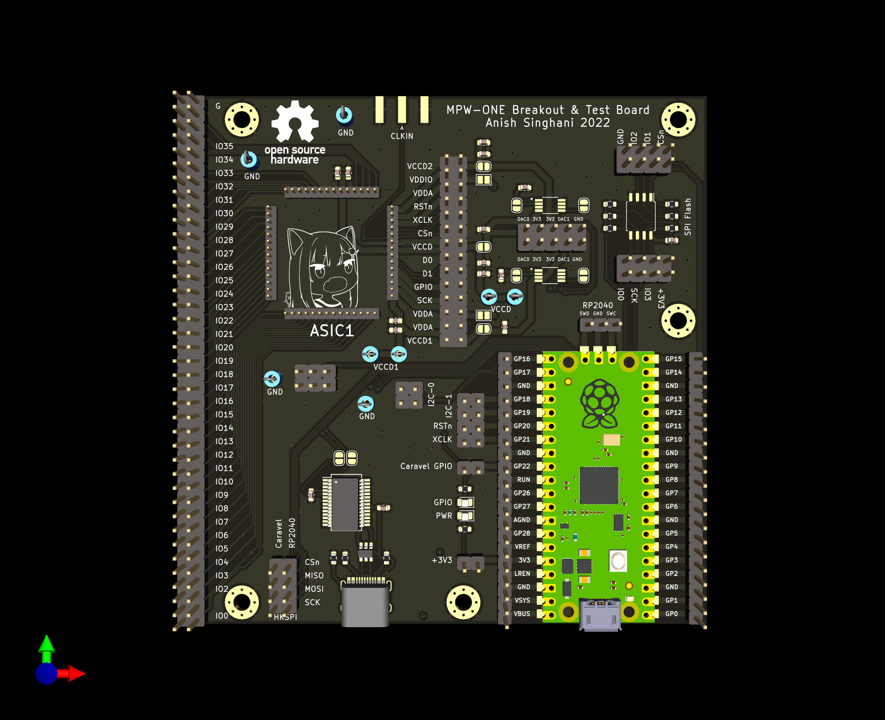
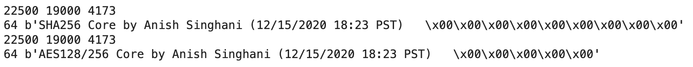
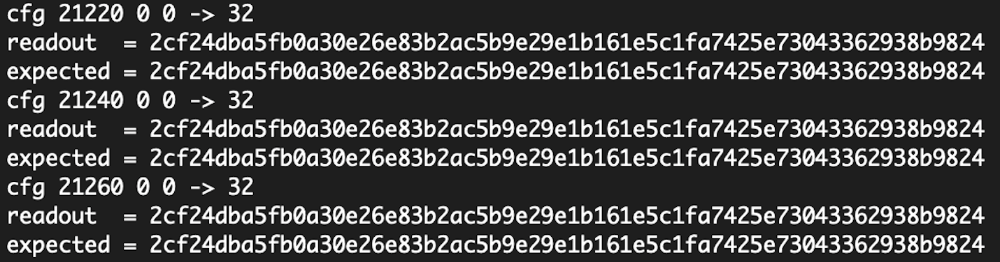

# mpw1-bringup

Experiments in salvating SKY130 MPW-ONE chips, 1.5 years after the initial tapeout in December 2020.

### Background

MPW-ONE was the first round of the open-source Google-sponsored tapeout, and as a result of tooling issues with the clock-tree verification, the standard "caravel" padframe used for all chips on the MPW contains timing violations. In this repo I am working with my submission to MPW-ONE and attempting to recover functionality using precise voltage and clock control to reduce the significance of these issues - [asinghani/crypto-accelerator-chip](https://github.com/asinghani/crypto-accelerator-chip)

### Board images

### Results

- Designed and fabricated a test board (see images above) with a Raspberry Pi Pico and DAC8571
- Implemented firmware (`ctrlfw/remote_ctrl_fw`) and associated Jupyter Notebooks (`notebooks/characterization.ipynb`) for searching possible voltages
- Using this script, tested ~20 dies and found a few that produced sufficient activity on the Flash memory bus
- Implemented a basic communication protocol in RISC-V assembly which allows bytes to be bit-banged (independent of clock frequency) through the single Caravel GPIO port (this means that GPIO do not need to be enabled in order to get data out of the Caravel core
- Used this protocol to read the identifier ROMs that I built in to the SHA256 and AES cores
- Wrote RISC-V code to the Caravel which runs SHA256 on a region of data from flash, and used this to verify the correctness of the SHA256 output (hence proving the correct functionality of the SHA256 core)

The AES core responded to commands but, despite varying the clock frequency, it was not possible to keep clock and power stable enough to get a full successful CBC encryption or decryption. It is likely that there are some dies in the batch where AES will work, but due to the inefficiency in soldering and testing each individual die, I have not tested this yet (I have instead re-submitted an updated version of the AES core to [MPW-THREE](https://github.com/asinghani/crypto-accelerator-chip-v2), using a version of the Caravel padframe does not have the clock-tree issue).
